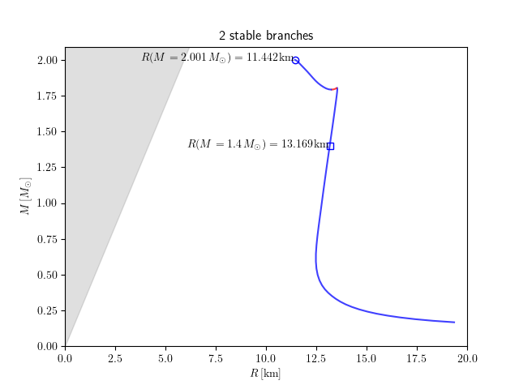

# Plasma Assignment 2

  * 25% of final grade
  * assigned 3 Nov 2023
  * due 17 Nov 2023

---

## Problem 1

> Compute the mass-radius curve for the attached Equation of State ([eos.csv](eos.csv)).
> This comma-separate value (csv) file contains the following columns
> 
>   * `pressurec2` : [g/cm^3] : pressure divided by the speed of light squared
>   * `energy_densityc2` [g/cm^3] : energy density divided by the speed of light squared
>   * `baryon_density` [g/cm^3] : rest-mass density
>   * `cs2c2` [dimensionless] : speed of sound squared divided by the speed of light squared
> 
> Identify the following points on a plot of the (gravitational) mass vs radius (i.e., label the plot with)
> 
>   * maximum mass
>   * radius at the maximum mass
>   * radius at 1.4 solar masses
> 
> Be sure to identify which branches are stable (solid lines) and which are unstable (dashed lines).
> 
> Plot the Schwarzschild radius as a function of mass on the same axes.

